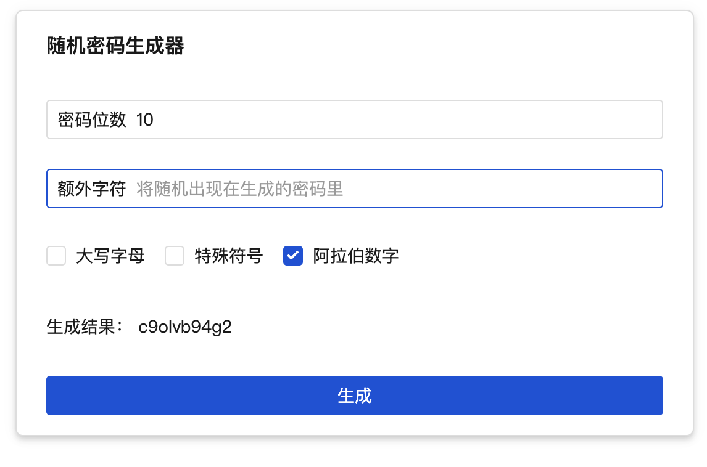

# Vue 3 版随机密码生成器

就是个玩具，连动态渲染和 Vue Router 都没用到的真·单页面应用，基于 Vue 3 + TDesign 组件库。因为就是个 demo，因此更多功能也没做。

## 常见问题

Q：明明原生 HTML + JS 就可以很轻松实现，用 Vue + TS 写非常浪费，故意的还是不小心的？

A：是故意的。目的是通过简单的例子来演示原生和 Vue 在各种实现的差别。原生代码在 `sample` 文件夹里面。

